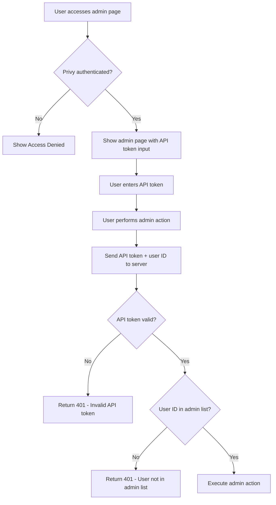

# Admin Authentication Security

This document explains the secure **two-factor authentication** system implemented for the Creator Score miniapp.

## Overview

The admin authentication system requires **BOTH** of the following for maximum security:

1. **Privy Authentication**: User must be authenticated via Privy SDK (browser-based)
2. **API Token**: Valid admin API token must be provided

This two-factor approach ensures that:
- Only authenticated users can access admin pages
- Only users with valid API tokens can perform admin actions
- Both authentication methods must be valid simultaneously

## Security Features

### 🔐 ADMIN_API_TOKEN
- **Cryptographically secure**: 64-byte random hex string
- **High entropy**: Resistant to brute force attacks
- **Easy rotation**: Can be changed without affecting user access
- **Server-only**: Never exposed to client-side code
- **Required**: Must be provided for all admin API calls

### 👤 Privy Authentication (Required for Page Access)
- **Privy SDK integration**: Validates user is authenticated through the app
- **Talent UUID verification**: Ensures user is in admin list
- **Session-based**: Tied to actual user login state
- **Browser-only**: Admin features not available in miniapp context
- **Required**: Must be authenticated to access admin pages

## Environment Variables

```bash
# Required for admin authentication
ADMIN_API_TOKEN=your_secure_64_byte_hex_token
ADMIN_UUIDS=uuid1,uuid2,uuid3  # Comma-separated list of admin Talent UUIDs
```

## Usage Patterns

### Two-Factor Authentication (Required)

```javascript
// Client-side: Check Privy authentication
const { talentId } = usePrivyAuth({});
const isAuthenticated = !!talentId;

// Client-side: Send both API token and user identifier
const response = await fetch('/api/admin/notifications/manual', {
  method: 'POST',
  headers: {
    'Authorization': `Bearer ${apiToken}`, // API token required
    'X-User-Id': talentId, // User identifier for validation
    'Content-Type': 'application/json'
  },
  body: JSON.stringify(notificationData)
});
```

### Server-Side Validation

```typescript
// Server-side: Validate both API token and user identifier
export async function validateAdminAuth(request: Request) {
  // 1. Validate API token
  const authHeader = request.headers.get("authorization");
  const token = authHeader?.slice("Bearer ".length).trim();
  
  if (!validateAdminApiToken(token)) {
    return new Response(JSON.stringify({ error: "Invalid API token" }), { status: 401 });
  }

  // 2. Validate user identifier
  const userIdentifier = request.headers.get("x-user-id");
  if (!validateAdminToken(userIdentifier)) {
    return new Response(JSON.stringify({ error: "User not in admin list" }), { status: 401 });
  }

  return null; // Both validations passed
}
```

## Endpoint Security Levels

| Endpoint | Security Level | Required Headers |
|----------|----------------|------------------|
| `/api/admin/notifications/manual` | Two-Factor | `Authorization: Bearer <API_TOKEN>`, `X-User-Id: <USER_ID>` |
| `/api/admin/notifications/users` | Two-Factor | `Authorization: Bearer <API_TOKEN>`, `X-User-Id: <USER_ID>` |
| `/api/admin/notifications/history` | Two-Factor | `Authorization: Bearer <API_TOKEN>`, `X-User-Id: <USER_ID>` |
| `/api/admin/invalidate-leaderboard-cache` | Two-Factor | `Authorization: Bearer <API_TOKEN>`, `X-User-Id: <USER_ID>` |

## Authentication Flow



## Security Benefits

| Security Feature | Description | Benefit |
|------------------|-------------|---------|
| **Two-Factor Authentication** | Requires both Privy auth + API token | Prevents unauthorized access even if one factor is compromised |
| **User Context Validation** | Validates user identifier against admin list | Ensures only authorized users can perform admin actions |
| **API Token Validation** | Validates cryptographically secure token | Prevents token spoofing and unauthorized API access |
| **Browser-Only Access** | Admin features only available in browser context | Reduces attack surface by limiting access methods |

## Security Best Practices

1. **Never commit tokens to version control**
2. **Use secrets managers in production**
3. **Rotate tokens regularly**
4. **Monitor admin API usage**
5. **Log all admin actions for audit**

## Migration from Old System

The old system used only `ADMIN_UUIDS` with Bearer token validation. The new system:

- ✅ Requires **both** Privy authentication AND API token
- ✅ Adds secure API token support
- ✅ Implements Privy-based user validation
- ✅ Provides maximum security for admin actions
- ✅ Prevents unauthorized access even if one factor is compromised

## Troubleshooting

### "Access Denied" on admin page
- **Cause**: Not authenticated via Privy
- **Solution**: Connect wallet/login via Privy SDK

### "Unauthorized - Invalid admin API token"
- **Cause**: API token doesn't match `ADMIN_API_TOKEN`
- **Solution**: Verify `ADMIN_API_TOKEN` environment variable is correct

### "Unauthorized - Invalid admin token"
- **Cause**: User's Talent UUID not in admin list
- **Solution**: Add user's Talent UUID to `ADMIN_UUIDS` environment variable

### "Unauthorized - Missing Bearer token"
- **Cause**: No Authorization header provided
- **Solution**: Include `Authorization: Bearer <token>` header

### "Unauthorized - Missing user identifier"
- **Cause**: No X-User-Id header provided
- **Solution**: Include `X-User-Id: <user_id>` header

## Implementation Notes

- **Browser-Only**: Admin features are **browser-only** and not available in miniapp context
- **Privy SDK**: Uses Privy SDK for user authentication instead of MiniKit
- **Two-Factor Required**: Both API token AND user authentication are required
- **User Identifier**: Uses `talentId` from Privy SDK as the user identifier
- **Header-Based**: User identifier is sent via `X-User-Id` header for server-side validation
- **All admin actions are logged for audit purposes**
