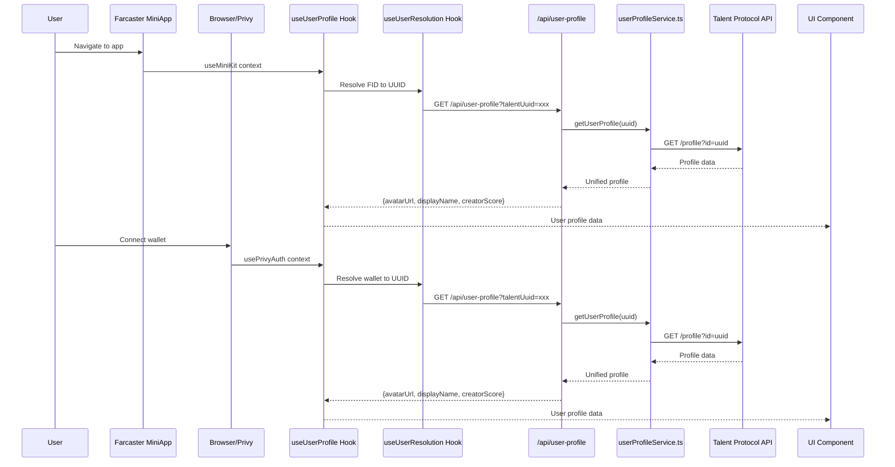
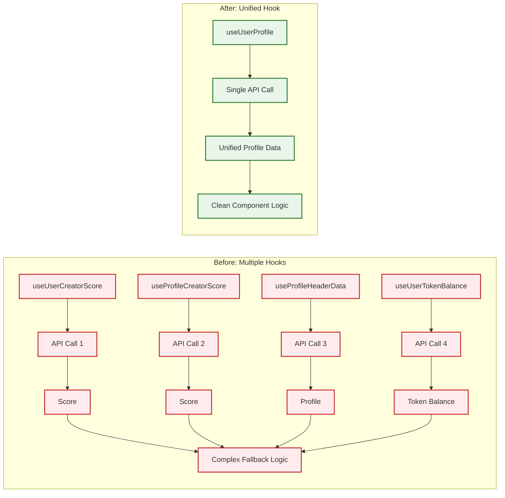
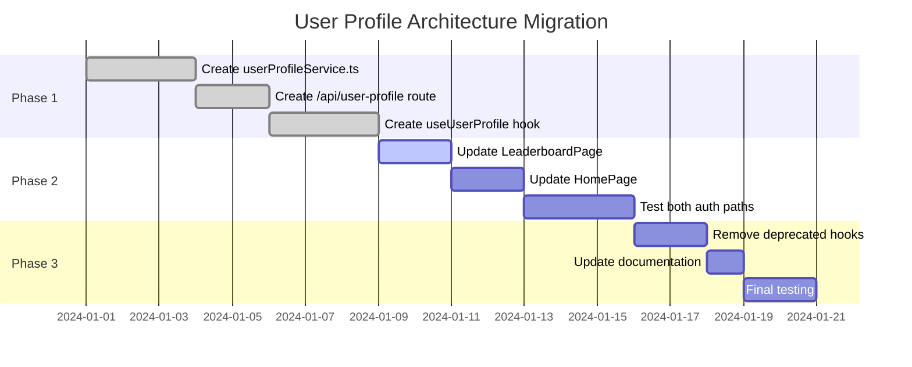
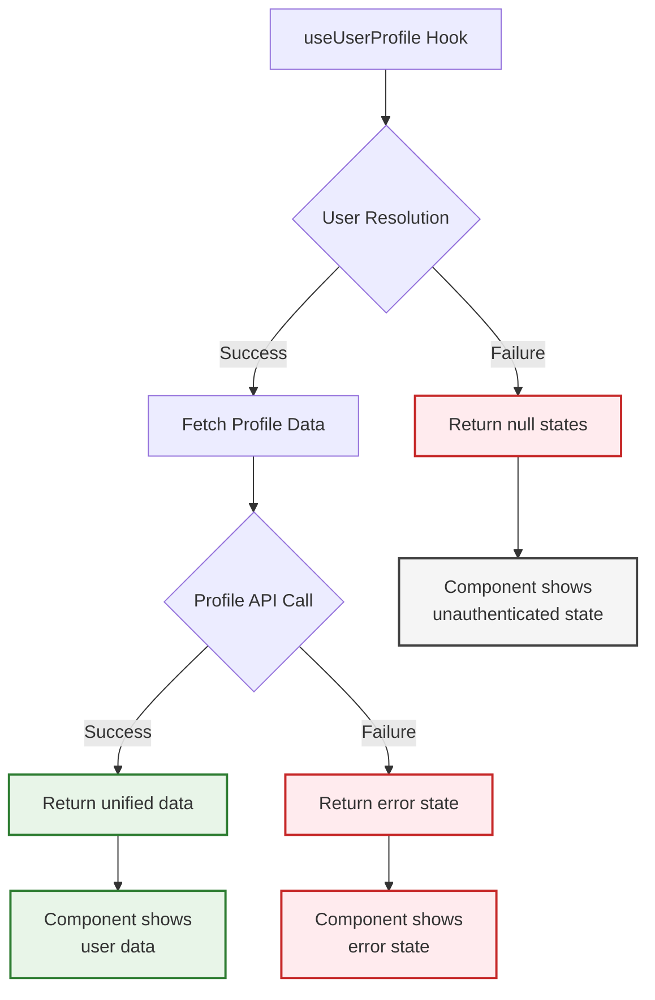

# New User Profile Data Architecture

## Overview Diagram

```mermaid
graph TD
    %% User Entry Points
    A1[Farcaster MiniApp<br/>User with FID] --> B1[useMiniKit Context]
    A2[Browser/Privy<br/>User with Wallet] --> B2[usePrivyAuth Hook]
    
    %% User Resolution Layer
    B1 --> C[useUserResolution Hook]
    B2 --> C
    C --> D{Resolve to Talent UUID}
    
    %% Resolution Logic
    D -->|FID Path| E1[resolveFidToTalentUuid]
    D -->|Wallet Path| E2[resolveWalletToTalentUuid]
    E1 --> F[Talent UUID]
    E2 --> F
    
    %% Unified Profile Hook
    F --> G[useUserProfile Hook]
    G --> H[/api/user-profile]
    
    %% Service Layer
    H --> I[userProfileService.ts]
    I --> J[Talent Protocol API<br/>/profile endpoint]
    
    %% Data Processing
    J --> K[Unified User Profile Data]
    K --> L[avatarUrl, displayName, creatorScore, hasTalentAccount]
    
    %% Component Usage
    L --> M[LeaderboardPage]
    L --> N[HomePage]
    L --> O[ProfilePage]
    
    %% Styling
    classDef entryPoint fill:#e1f5fe,stroke:#01579b,stroke-width:2px
    classDef hook fill:#f3e5f5,stroke:#4a148c,stroke-width:2px
    classDef service fill:#e8f5e8,stroke:#1b5e20,stroke-width:2px
    classDef api fill:#fff3e0,stroke:#e65100,stroke-width:2px
    classDef data fill:#fce4ec,stroke:#880e4f,stroke-width:2px
    classDef component fill:#f1f8e9,stroke:#33691e,stroke-width:2px
    
    class A1,A2 entryPoint
    class B1,B2,C,G hook
    class I service
    class H,J api
    class K,L data
    class M,N,O component
```

## Detailed Data Flow



## Architecture Comparison

### Before (Current State)
```mermaid
graph TD
    A[User] --> B1[useUserCreatorScore<br/>FID-based]
    A --> B2[useProfileCreatorScore<br/>UUID-based]
    A --> B3[useProfileHeaderData<br/>UUID-based]
    A --> B4[useUserTokenBalance<br/>UUID-based]
    
    B1 --> C1[/api/talent-score]
    B2 --> C2[getCreatorScoreForTalentId]
    B3 --> C3[resolveTalentUser]
    B4 --> C4[/api/user-token-balance]
    
    C1 --> D1[Talent API]
    C2 --> D2[Talent API]
    C3 --> D3[Talent API]
    C4 --> D4[Talent API]
    
    D1 --> E1[Score only]
    D2 --> E2[Score only]
    D3 --> E3[Profile only]
    D4 --> E4[Token balance only]
    
    E1 --> F[Complex fallback logic]
    E2 --> F
    E3 --> F
    E4 --> F
    
    F --> G[UI Component]
    
    classDef hook fill:#f3e5f5,stroke:#4a148c,stroke-width:2px
    classDef api fill:#fff3e0,stroke:#e65100,stroke-width:2px
    classDef data fill:#fce4ec,stroke:#880e4f,stroke-width:2px
    
    class B1,B2,B3,B4 hook
    class C1,C2,C3,C4 api
    class E1,E2,E3,E4 data
```

### After (New State)
```mermaid
graph TD
    A[User] --> B[useUserProfile<br/>Unified]
    
    B --> C[/api/user-profile]
    C --> D[userProfileService.ts]
    D --> E[Talent API<br/>/profile endpoint]
    
    E --> F[Unified Profile Data<br/>avatarUrl, displayName, creatorScore, hasTalentAccount]
    F --> G[UI Component]
    
    classDef hook fill:#f3e5f5,stroke:#4a148c,stroke-width:2px
    classDef api fill:#fff3e0,stroke:#e65100,stroke-width:2px
    classDef data fill:#fce4ec,stroke:#880e4f,stroke-width:2px
    
    class B hook
    class C api
    class F data
```

## Key Benefits Visualization



## Implementation Phases



## Data Structure Evolution

### Before: Fragmented Data
```typescript
// Multiple hooks returning different data
const { creatorScore: fidScore } = useUserCreatorScore(user?.fid);
const { creatorScore: uuidScore } = useProfileCreatorScore(userTalentUuid);
const { profile } = useProfileHeaderData(userTalentUuid);
const { balance: tokenBalance } = useUserTokenBalance(userTalentUuid);

// Complex fallback logic
const creatorScore = fidScore ?? uuidScore ?? 0;
const avatarUrl = user?.pfpUrl ?? profile?.image_url;
const name = user?.displayName ?? user?.username ?? profile?.display_name ?? profile?.fname ?? "Unknown user";
```

### After: Unified Data
```typescript
// Single hook returning all data
const { 
  talentUuid, 
  displayName, 
  avatarUrl, 
  creatorScore, 
  loading: profileLoading,
  hasTalentAccount,
  source 
} = useUserProfile();

// Clean, simple usage
const name = displayName || "Unknown user";
const score = creatorScore;
```

## Error Handling Flow



This diagram shows the complete transformation from the current fragmented architecture to the new unified approach, highlighting the benefits, implementation phases, and data flow improvements.
